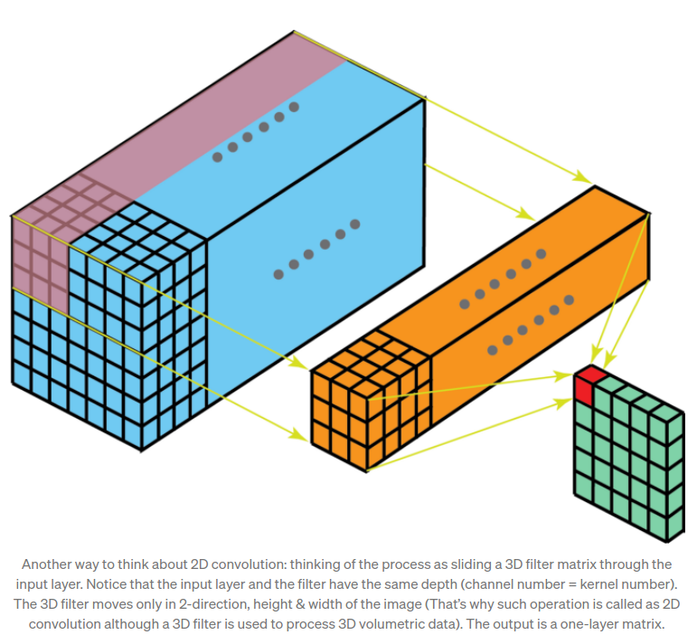
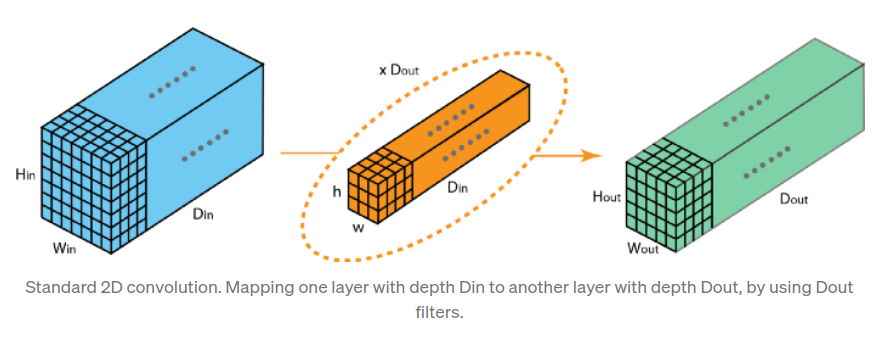

# Design Requirements
The goal of this work is to provide a repurposable 6DOF pose estimation algorithm in a ROS package to provide advanced sensing for deployed robotic systems.
- **Repurposable** pose estimation (i.e. can estimate the pose of new objects if data is generated for them).
- **Edge-compatible** algorithm and software for pose estimation that can run on edge devices (e.g. the Jetson Xavier NX or Jetson Nano) at usable rates (e.g. 5 Hz or faster).
- **Markerless** pose estimation algorithms that work on unprepared objects without fiducials. 

# Resources
- [MobileNet V2](https://www.tensorflow.org/api_docs/python/tf/keras/applications/MobileNetV2) and [MobileNet V3 Large](https://www.tensorflow.org/api_docs/python/tf/keras/applications/MobileNetV3Large) and [MobileNet V3 Small](https://www.tensorflow.org/api_docs/python/tf/keras/applications/MobileNetV3Small)
- [Transfer Learning with TensorFlow Hub](https://www.tensorflow.org/tutorials/images/transfer_learning_with_hub)
- [Transfer Learning and fine-tuning](https://www.tensorflow.org/tutorials/images/transfer_learning)
- [Load images](https://www.tensorflow.org/tutorials/load_data/images)
- Use [Tensorboard](https://www.tensorflow.org/tensorboard) to monitor the training.
- [Camera-to-Robot Pose Estimation from a Single Image](https://research.nvidia.com/publication/2020-03_DREAM)
- [Deep Object Pose Estimation for Semantic Robotic Grasping of Household Objects](https://arxiv.org/abs/1809.10790) and the [DOPE repo](https://github.com/NVlabs/Deep_Object_Pose)
- [Indirect Object-to-Robot Pose Estimation from an External Monocular RGB Camera](https://research.nvidia.com/publication/2020-07_Indirect-Object-Pose)
- [NVIDIA Dataset Utilities](https://github.com/NVIDIA/Dataset_Utilities) a.k.a. NVDU
- [NVIDIA Deep Learning Dataset Synthesizer](https://github.com/NVIDIA/Dataset_Synthesizer) a.k.a. NDDS
- [FAT Dataset](https://research.nvidia.com/publication/2018-06_Falling-Things), a.k.a. Falling Things: A Synthetic Dataset for 3D Object Detection and Pose Estimation
- [Camera Calibration and 3D Reconstruction](https://docs.opencv.org/master/d9/d0c/group__calib3d.html) (OpenCV docs on SolvePnP and Camera Calibration)
- [Keras Computer Vision Code Examples](https://keras.io/examples/vision/)
- [A Comprehensive Introduction to Different Types of Convolutions in Deep Learning](https://towardsdatascience.com/a-comprehensive-introduction-to-different-types-of-convolutions-in-deep-learning-669281e58215)
- My notes on [Creating the Custom Network](https://www.dropbox.com/scl/fi/bcrtxctjvgwm9dmg5momm/Creating-the-Custom-Network.gdoc?dl=0&rlkey=l4r086grmn2oio2vrxmici5th)

# Dev Notes
## Virtual Environment Setup
Setup the virtual environment for this project.

On Ubuntu:
```bash
python3 -m venv pose-est-env
source pose-est-env/bin/activate
pip install --no-cache-dir --upgrade pip
pip install --upgrade setuptools
pip install -r ./requirements.txt
curl -fsSL https://deb.nodesource.com/setup_15.x | sudo -E bash -
sudo apt install npm nodejs
jupyter labextension install jupyterlab-plotly
jupyter labextension install @jupyter-widgets/jupyterlab-manager plotlywidget
```
On Windows:
```bash
python -m venv pose-est-env
.\pose-est-env\Scripts\activate
pip install -r .\requirements.txt
```

## Dataset Setup
1. Install the [NVDU tool](https://github.com/NVIDIA/Dataset_Utilities) from source.

    ```
    cd ~/catkin_ws/src/pose_est/
    git clone https://github.com/NVIDIA/Dataset_Utilities.git
    cd Dataset_Utilities
    pip install -e .
    ```
2. Setup the YCB objects while in the same directory
    ```
    nvdu_ycb -s
    ```
3. Download the dataset from the [Falling things page](https://research.nvidia.com/publication/2018-06_Falling-Things) (*External Links* > *dataset*). It will take a while to download the whole 42Gb dataset. While you're waiting, read the [FAT Dataset](fat_dataset.md) readme.

    Extract the dataset to the `~catkin_ws/src/pose_est/data/` folder.


>Note, when trying to use the [NVDU tool](https://github.com/NVIDIA/Dataset_Utilities) to list the available objects or download the YCB 3D model dataset, the following errors are observed:
>```
> nvdu_ycb -l
> Supported YCB objects:
> Traceback (most recent call last):
>   File "/home/alonzo/catkin_ws/src/pose_est/pose-est-env/bin/nvdu_ycb", line 8, in <module>
> sys.exit(main())
>   File "/home/alonzo/catkin_ws/src/pose_est/pose-est-env/lib/python3.8/site-packages/nvdu/tools/nvdu_ycb.py", line 234, in main
>     log_all_object_names()
>   File "/home/alonzo/catkin_ws/src/pose_est/pose-est-env/lib/python3.8/site-packages/nvdu/tools/nvdu_ycb.py", line 105, in log_all_object_names
>     for obj_name, obj_settings in all_ycb_object_settings.obj_settings.items():
> AttributeError: 'NoneType' object has no attribute 'obj_settings'
> ```
> ```
> nvdu_ycb -s
> Traceback (most recent call last):
>   File "/home/alonzo/catkin_ws/src/pose_est/pose-est-env/bin/nvdu_ycb", line 8, in <module>
>     sys.exit(main())
>   File "/home/alonzo/catkin_ws/src/pose_est/pose-est-env/lib/python3.8/site-packages/nvdu/tools/nvdu_ycb.py", line 237, in main
>     setup_all_ycb_models()
>   File "/home/alonzo/catkin_ws/src/pose_est/pose-est-env/lib/python3.8/site-packages/nvdu/tools/nvdu_ycb.py", line 214, in setup_all_ycb_models
>     for obj_name, obj_settings in all_ycb_object_settings.obj_settings.items():
> AttributeError: 'NoneType' object has no attribute 'obj_settings'
> ```
> However, `nvdu_ycb -h` does work.


## Visualizing the Dataset
To visualize data in the dataset, navigate to a folder and use the `nvdu_viz` command to visualize select images. 
```
nvdu_viz -m <path-to-model> -n <selected-images>
```

For example,
```
cd ~/catkin_ws/src/pose_est/data/fat/single/010_potted_meat_can_16k/kitchen_0
nvdu_viz -m /home/alonzo/catkin_ws/src/pose_est/Dataset_Utilities/nvdu/data/ycb/original/010_potted_meat_can/google_16k -n 000000* 000001*
```

Use the [NVDU Controls](https://github.com/NVIDIA/Dataset_Utilities#controls) to control how the frames, keypoints, and models render.

>**Note:** some of the images may throw an error. For example, 
>```
>nvdu_viz -m /home/alonzo/catkin_ws/src/pose_est/Dataset_Utilities/nvdu/data/ycb/original/010_potted_meat_can/google_16k -n 000002*
>```
>because they try to visualize the json:
>```
>visualize_dataset_frame: frame_image_file_path: ./000002.left.json - frame_data_file_path: ./000002.left.json
>```
>but they work when you specify the image path in more detail:
>```
>nvdu_viz -m /home/alonzo/catkin_ws/src/pose_est/Dataset_Utilities/nvdu/data/ycb/original/010_potted_meat_can/google_16k -n 000002.right* 000002.left.jpg
>```
> The following error was also observed:
> ```
> pyglet.gl.ContextException: Could not create GL context
> ```
> and the solution was to restart the computer.

## Interpreting the Dataset
See [File Details](fat_dataset.md#file-details) for details on the annotation files for both camera properties and json image labels.

Note that the camera properties are the same across the entire dataset, so we only need to load one for solvePnPRansac().

## Types of convolutions in the Network
For a refresher on types of convolutions, see [A Comprehensive Introduction to Different Types of Convolutions in Deep Learning](https://towardsdatascience.com/a-comprehensive-introduction-to-different-types-of-convolutions-in-deep-learning-669281e58215). 
- 2D convolution
    
    
- Depthwise separable convolution
    
    
    

## What is DOPE predicting?
> In short, for each object that requires a pose estimation, DOPE predicts nine belief maps and eight vector fields. Each of the nine belief maps correspond to a cuboid keypoint (eight vertices plus one centroid makes nine total keypoints). The eight vector fields indicate the direction from each of the eight vertices to its corresponding centroid in order to enable detection of multiple instances of the same object.[- Tremblay, 2](https://arxiv.org/pdf/1809.10790.pdf)

> After the network has processed an image, it is necessary to extract the individual objects from the belief maps. In contrast to other approaches in which complex architectures or procedures are required to individuate the objects [4, 5, 22, 6], our approach relies on a simple postprocessing step that searches for local peaks in the belief maps above a threshold, followed by a greedy assignment algorithm that associates projected vertices to detected centroids. For each vertex, this latter step compares the vector field evaluated at the vertex with the direction from the vertex to each centroid, assigning the vertex to the closest centroid within some angular threshold of the vector. Once the vertices of each object instance have been determined, a PnP algorithm [12] is used to retrieve the pose of the object, similar to [6, 4]. This step uses the detected projected vertices of the bounding box, the camera intrinsics, and the object dimensions to recover the final translation and rotation of the object with respect to the camera. All detected projected vertices are used, as long as at least the minimum number (four) are detected. [- Tremblay, 3](https://arxiv.org/pdf/1809.10790.pdf)

## Training
### Ground Truth Belief Maps
> To avoid the vanishing gradients problem with our network, a loss was computed at the output of each stage, using the L2 loss for the belief maps and vector fields. The ground truth belief maps were generated by placing 2D Gaussians at the vertex locations with σ = 2 pixels. [- Tremblay, 5](https://arxiv.org/pdf/1809.10790.pdf)

For more info on how ground truth belief maps are created, see the CreateBeliefMap() function on line 834 in [DOPE's train.py](https://github.com/NVlabs/Deep_Object_Pose/blob/master/scripts/train.py)

The belief maps I'm working with are written slightly differently, expect a slightly different input, but produce the same output.

For a given image, for example,


Nine belief maps are produced indicating the belief map for each keypoint. For example, for keypoint #1:


And keypoint #2:


And so on for the remaining keypoints (including the centroid). 
**Important** if the object appears twice in the scene (e.g. two spam cans), then each keypoint belief map will feature two keypoints, one for each can. For example, an image with two cans will show the following for keypoint #1's belief map:


### Ground Truth Vector Fields
> The ground truth vector fields were generated by setting pixels to the normalized x- and y-components of the vector pointing toward the object’s centroid. Only the pixels within a 3-pixel radius of each groundtruth vertex were set in this manner, with all other pixels set to zero. Wherever more than one vertex resided within this radius, one of them was selected at random to be used for generating these components. [- Tremblay, 5](https://arxiv.org/pdf/1809.10790.pdf)

### Data Augmentation
> For training we used ∼60k domain-randomized image frames mixed with ∼60k photorealistic image frames. Whereas we used a separate set of ∼60k images in the former case (one dataset per object), in the latter case we used the same dataset for all objects, since it consists of the 21 YCB objects randomly interacting with one another. For data augmentation, Gaussian noise (σ = 2.0), random contrast (σ = 0.2) and random brightness (σ = 0.2) were added. For PoseCNN [5], we used the publicly available weights, which were trained using an undisclosed synthetic dataset and fine-tuned on images from separate videos of the YCB-Video dataset. [- Tremblay, 5](https://arxiv.org/pdf/1809.10790.pdf) 

### Loss Function
Pixel-wise cross entropy loss is a common loss function for the image segmentation task. This examines each pixel individually and compares the prediction (depth-wise pixel vector prediction across all classes) with the one-hot encoded target vector. Both the NVIDIA GTC Image Segmentation example and the [overview of semantic image segmentation](https://www.jeremyjordan.me/semantic-segmentation/#:~:text=One%20popular%20approach%20for%20image,upsample%20the%20feature%20representations%20into) recommend using this.
 
The GTC notebook describes this as Cross Entropy loss applied to a class-wise probability for each pixel after using a softmax operation.
 


### Distributed Training
[Distributed training with TensorFlow](https://www.tensorflow.org/guide/distributed_training) - main page including overview, strategy descriptions, then links to keras tutorials.

[Distributed training with Keras](https://www.tensorflow.org/tutorials/distribute/keras) - tutorial.
Use TF’s distributed training or Horovod to train across both GPUs. 

## TensorRT
See notes [here](https://www.dropbox.com/scl/fi/bcrtxctjvgwm9dmg5momm/Creating-the-Custom-Network.gdoc?dl=0&rlkey=l4r086grmn2oio2vrxmici5th) for more to bring to this doc.